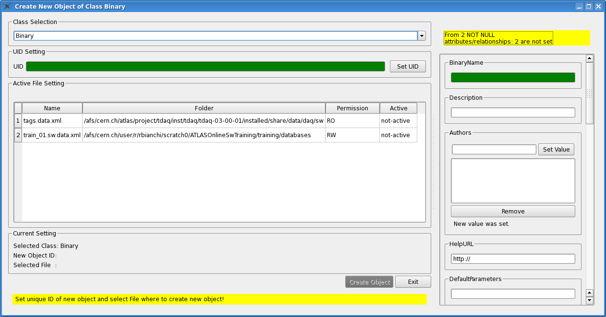
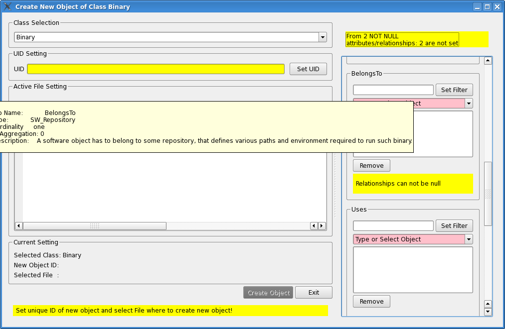
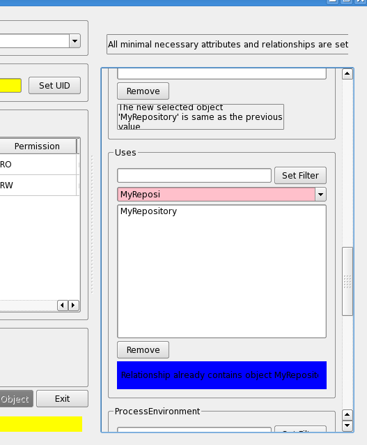
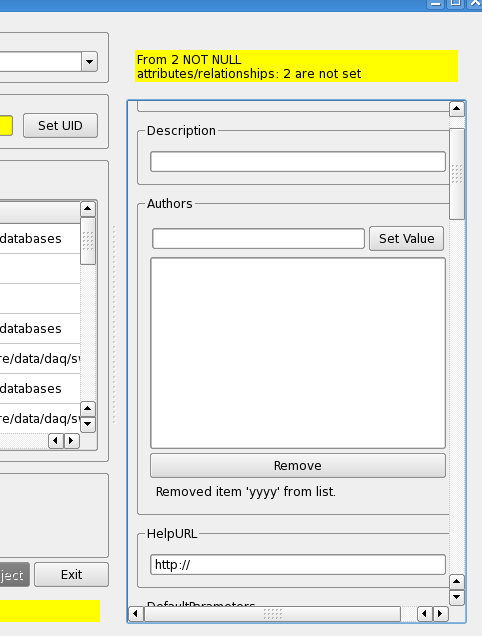
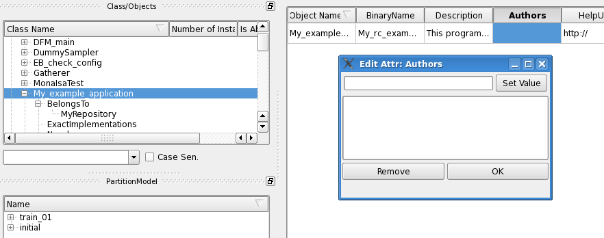
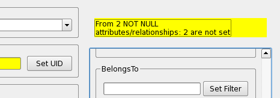
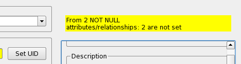

.. _createObject_sec:

################################
"Create New Object" window style
################################

.. highlight:: c++
   :linenothreshold: 5

QLineEdit instances
===================

.. _createObjMain_fig:

   "Create New Object" window
   

In Figure :num:`figure #createobjmain-fig` the main window of the "Create New Object" context command for a "Binary" object is shown. 
The field UID and name have been colored in green on purpose, here, to show the different attributes of the widgets.
   
   
   
The ``Binary`` and similars are instances of the ``ValidatorLineEdit`` class, derived from the Qt class ``QLineEdit``, and declared in the file ``dbe/object/validatorlineedit.h``::

   class ValidatorLineEdit: public QLineEdit

   
The green background is set inside ``validatorlineedit.cpp``, with this command::

    m_alertPalette.setColor(QPalette::Active,QPalette::Base,QColor("green"));
    
in the constructor::

    ValidatorLineEdit::ValidatorLineEdit(QWidget * parent, bool withNotNullCheck):
        QLineEdit(parent),
        m_withNotNullCheck(withNotNullCheck),
        m_isValid(false)
    {
      m_originalPalette = this->palette();
      m_alertPalette.setColor(QPalette::Active,QPalette::Base,QColor("green"));
      this->setPalette(m_alertPalette);
      QObject::connect(this,SIGNAL(textChanged(const QString&)),this,SLOT(tryValidate(const QString&)));
    }

QComboBox / ValidatorComboBox instances
=======================================

Let's now see this other picture :num:`figure #createcombobox-fig`. 

.. _createComboBox_fig:

   Modified QComboBox

It's exactly the same window as above, but here we modified the color of the background of the QComboBox instances present in the right side. This color is set with this command::

   m_alertPalette.setColor(QPalette::Active,QPalette::Base, QColor("pink"));

in the constructor of the validator class ``ValidatorComboBox`` which we derived from ``QComboBox``, in the file ``src/validatorcombobox.cpp``::

   ValidatorComboBox::ValidatorComboBox(QWidget * parent):QComboBox(parent),
        m_isValid(false),m_isObligatory(true),m_completer(0),m_matchValidator(0),m_noMatchValidator(0),m_changed(false)
    {
      m_originalPalette = this->palette();
      m_alertPalette.setColor(QPalette::Active,QPalette::WindowText, QColor("yellow"));
      m_alertPalette.setColor(QPalette::Active,QPalette::Base, QColor("pink"));
      this->setPalette(m_alertPalette);
      QObject::connect(this,SIGNAL(editTextChanged(const QString&)),this,SLOT(tryValidate(const QString&)));
      QObject::connect(this,SIGNAL(activated(const QString&)),this,SLOT(changeDetected(const QString&)));
    }

The class ``ValidatorComboBox`` is declared in the header file ``dbe/object/validatorcombobox.h``::

   class ValidatorComboBox: public QComboBox

In the figure below (Figure :num:`figure #comboboxpalette-fig`) we'll see in detail the palettes used in combination with alert messages. The pink background in the choice field of the ComboBox is used if the choice is not validated (in this case the string "MyRepository" is still being written, and it does not match yet); while the blue background is here used because we set "MyRepository" twice. 

.. _comboBoxPalette_fig:

   The palette of a ComboBox

The blue color for the ``Warning`` message is set in ``attrandreleditors.cpp`` with this command::

    m_warningStatusBarPalette.setColor(QPalette::Active,QPalette::Window,QColor("green"));

inside the method ``EditRelationshipWidget::setStatusBar()``::

   void EditRelationshipWidget::setStatusBar()
   {
   m_statusBar = new QStatusBar(statusFrame);//create status bar owned by frame widget
   m_statusBar->setSizeGripEnabled(false);
   statusFrame->setFrameStyle(QFrame::NoFrame);//no frame arround status bar
   statusLayout->addWidget(m_statusBar);//add widget to Frame
   //store original status bar palette with respect of global GUI setting
   m_originalStatusBarPalette = m_statusBar->palette();

   //create alert palette for case critical message is displayed
   m_alertStatusBarPalette.setColor(QPalette::Active,QPalette::Window,QColor("yellow"));
   m_alertStatusBarPalette.setColor(QPalette::Inactive,QPalette::Window,QColor("yellow"));

   // create palette for warning messages
   m_warningStatusBarPalette.setColor(QPalette::Active,QPalette::Window,QColor("blue"));
   
   //set status bar to be ready for palette changes
   m_statusBar->setAutoFillBackground(true);
  }

Of course the blue background is not suitable for a clean view; it has been used here only for the sake of showing the usage of the palettes.

EditTextAttrWidget, EditStringAttrWidget EditNumericAttrWidget instances
========================================================================

.. _editMultiAttr_fig:

   Detail of "EditMultiAttrWidget"

In the figure above (Figure :num:`figure #editmultiattr-fig`)  the rendering of the ``EditMultiAttrWidget`` class is shown. Such a widget is composed by several other widgets, choosen programatically according to the type of the object to be edited, by the constructor of the EditMutiAttrWidget class, in the file ``src/object/attrandreleditors.cpp``::

  EditMultiAttrWidget::EditMultiAttrWidget( daq::config::attribute_t attr,QWidget *parent, bool owned)
    :QWidget(parent),combo(0),m_numW(0),m_strW(0),m_isValid(true),m_changed(false),m_parent(parent),m_owned(owned)
  {
  m_attribute = attr;
  setWindowTitle(QString("Edit Attr: %1").arg(attr.p_name.c_str()));

  QVBoxLayout *mainLayout = new QVBoxLayout(this);
  mainLayout->setSpacing(4);
  mainLayout->setMargin(2);
  QHBoxLayout *buttonLayout = new QHBoxLayout(this);
  m_listView = new QListWidget(this);

  if(m_attribute.p_type == daq::config::enum_type)
    {
      combo = new ValidatorComboBox(this);
      mainLayout->addWidget(combo);
      QObject::connect(combo, SIGNAL(activated(const QString &)), this, SLOT(addToList(const QString &)));
    }
  if(configUtil::isNumber(m_attribute))
    {
      m_numW =  new EditNumericAttrWidget(m_attribute,this);
      QObject::connect(m_numW, SIGNAL(valueChanged()), this, SLOT(lineWidgetChanged()));
      mainLayout->addWidget(m_numW);
    }
  else if(m_attribute.p_type == daq::config::string_type)
    {
      m_strW =  new EditStringAttrWidget(m_attribute,this);
      QObject::connect(m_strW, SIGNAL(valueChanged()), this, SLOT(lineWidgetChanged()));
      mainLayout->addWidget(m_strW);
    }
  else if(m_attribute.p_type == daq::config::class_type)
    {
      m_strW =  new EditStringAttrWidget(m_attribute,this);
      QObject::connect(m_strW, SIGNAL(valueChanged()), this, SLOT(lineWidgetChanged()));
      mainLayout->addWidget(m_strW);
    }
  else if(m_attribute.p_type == daq::config::date_type)
    {
      m_strW =  new EditStringAttrWidget(m_attribute,this);
      QObject::connect(m_strW, SIGNAL(valueChanged()), this, SLOT(lineWidgetChanged()));
      mainLayout->addWidget(m_strW);
    }
  else if(m_attribute.p_type == daq::config::time_type)
    {
      m_strW =  new EditStringAttrWidget(m_attribute,this);
      QObject::connect(m_strW, SIGNAL(valueChanged()), this, SLOT(lineWidgetChanged()));
      mainLayout->addWidget(m_strW);
    }

  m_okButton = new QPushButton(tr("OK")); // TODO: check! who is this "OK" button???
  m_removeButton = new QPushButton(tr("Remove"));
  //m_lineEButton = new QPushButton(tr("Add Value"));
  buttonLayout->addWidget(m_removeButton);
  buttonLayout->addWidget(m_okButton);
  
  QObject::connect(m_okButton, SIGNAL(clicked()), this, SLOT( endSignal()));
  QObject::connect(m_removeButton, SIGNAL(clicked()), this, SLOT(removeFromList()));
  QObject::connect(this, SIGNAL(internalValueChanged()), this, SLOT(updateActions()));
  //QObject::connect(lineEButton, SIGNAL(clicked()), this, SLOT(addToList()));
  
  
  mainLayout->addWidget(m_listView);
  mainLayout->addLayout(buttonLayout);
  setStatusBar();
  mainLayout->addWidget(m_statusBar);//add widget to Frame
  
  setLayout(mainLayout);
  if(m_attribute.p_is_not_null)
    {
      m_isValid=false;
      m_okButton->setDisabled(true);
    }
  if(m_owned)
    {
      m_okButton->setHidden(true);
    }
  buildWidgetToolTip();
  updateActions(); // first call
  }

And so on, with other types and widgets.  Then a QListView is also added, to show the values, and two buttons, "Remove" and "Ok", as in the picture above.
The button "Ok" is the hidden if the widget is part of the Create Object" as in the figure above. It's instead, left on the widget, if the widget is taken alone to "edit" a certain value of an object, like here in the figure below (Figure :num:`figure #editstring-fig`), double-clicking on the "Authors" field of an object:

.. _editString_fig:

   The stand-alone "EditStringAttrWidget"

Let's consider now the insert functionality. By default, once inserted a value in the text field, only if we click on the "Set Value" button, the value si added to the list below.

Please notice that the "Set Value" button in defined in the ".ui" classes (e.g. in the ``ui/simpleattr.ui``) with the QT Designer with the object name of ``setValueButton``, and not programatically. 
But then programatically is used in the file ``src/attrandreleditors.cpp`` by the classes ``EditStringAttrWidget``,  ``EditTextAttrWidget`` and  ``EditNumericAttrWidget``. All those classes connect the button "clicked()" signal to the "addToList()" slot, to add the value typed in the text field.

Style using *stylesheet*
========================

Qt let the developer use QSS *stylesheets* to change the look&feel of the widgets. QSS is similar to CSS. I started to use the stylesheet in "dbe", introducing these lines of code in the ``main()`` function, defined in the file ``main.cpp``::

  QApplication app(argc, argv);
  //...
  QFile data(":/theme/stylesheet2.qss");
  //...
  QTextStream styleIn(&data);
  style = styleIn.readAll();
  //...
  qApp->setStyleSheet(style);

The stylesheet file is in ``theme/stylesheet2.qss``.

For example the stylesheet is used to get rid of the ugly box around message labels in the status bar, as those shown in figure :num:`figure #uglylables-fig` below. Applying a value ``0`` to the attribute ``border`` of QStatusBar instances (as in the lines below), the lables are then displayed in a clean better way, as shown in Figure :num:`figure #cleanlabels-fig`:

.. code-block:: css

  QStatusBar::item { border: 0px solid black }

.. _uglyLables_fig:

   Status Bar label with a default ugly border

.. _cleanLabels_fig:

   Status Bar label without a border after applying the stylesheet

