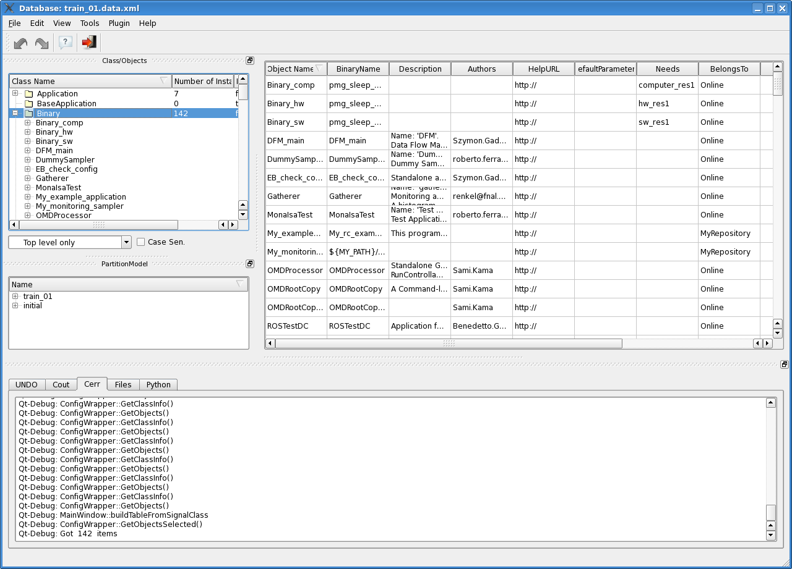
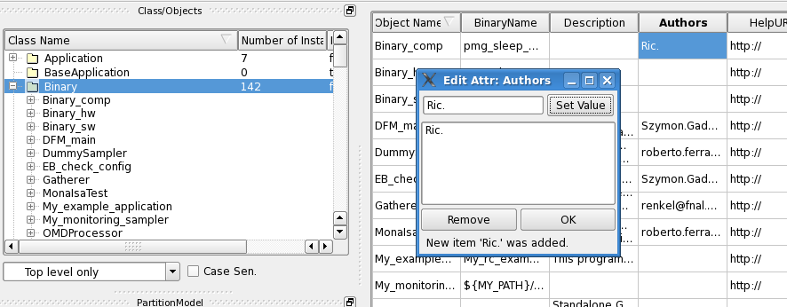

###################################
Communication with the underlain DB
###################################

Communication with the DB at start
==================================

Let's take the screenshot in the figure below (Figure :num:`figure #mainwindow-fig`). 
It shows the main window of the "dbe" at startup.

.. _mainWindow_fig:

   Main window at start

When the dbe is started, the following methods are called recursevely, in order to load the objects from the DB file that was loaded::

  ConfigWrapper::GetObjectsSelected() 
  ConfigWrapper::GetClassInfo()
  ConfigWrapper::GetSuperClassSet() 
  ConfigWrapper::GetClassInfo() 
  ConfigWrapper::GetObjects()

The tree is then populated with the retrieved objects.

When the user clicks on the Tree element "Binary" on the left, the following methods are called, in order to build the table on the upper-right side::

  MainWindow::buildTableFromSignalClass 
  ConfigWrapper::GetObjectsSelected() 
  Qt-Debug: Got  142  items

The class ConfigWrapper implements the Singleton pattern: the constructor is private, and there's a static method called "istance" to get an istance of the class.

Update of an Attribute
======================

Let's see now how the change of an attribute is handled by the "dbe" editor.
When double-clicking on an attribute of an item on the table (see Figure :num:`figure #changeattribute-fig`), let's say "Authors", an instance of the ``EditMultiAttrWidget`` class is created, as already shown in the Section :ref:`createObject_sec`. The function ``EditMultiAttrWidget::updateActions()`` is first call, to load the attributes already present in the attribute, if any (not in the example in the figure below). We then add an item to the attribute, in this case an author name, and we click on "Set Value". The ``setValueButton`` object is defined in the ``ui/simpleattr.ui`` file, and it's then connected to the function ``addToList()`` of the related widget, ``EditStringAttrWidget`` in this example (remember that ``EditMultiAttrWidget`` loads other "Edit-X-AttrWidget" according to the type of the attribute to be handled).

.. _changeAttribute_fig:

   Detail of Edit Attribute widget

So, the "Set Value" button, being connected to the ``EditStringAttrWidget::addToList()`` function (in this example where the attribute holds strings), adds the new value to the internal list of values for the widget. Then at the end of ``EditStringAttrWidget::addToList()`` the ``valueChanged`` SIGNAL is emitted, which is connected to the ``lineWidgetChanged`` SLOT of the container ``EditMultiAttrWidget`` widget. In the constructor we see, in fact (in the file ``src/object/attrandreleditors.cpp``)::

  m_strW =  new EditStringAttrWidget(m_attribute,this);
  QObject::connect(m_strW, SIGNAL(valueChanged()), this, SLOT(lineWidgetChanged()));
  
the ``lineWidgetChanged`` SLOT calls the ``EditStringAttrWidget::addToList()`` method, in order to add the new value to the QListWidget ``listView``. Then the ``updateActions()`` method is called, to check if the property ``p_is_not_null`` of the attribute is satisfied (some attributes can not be empty). The ``endSignal`` function is then called, at once if the widget is part of the "createObject" window like in the figure at (REF) (i.e. if the variable ``m_owned`` is True), or when the user clicks on the "Ok" button if the widget is on its own, like in the example figure above. 

If the widget is stand-alone as in the example above (``m_owned`` equal to False), then the ``finishEdit()`` SIGNAL is emitted, which is connected to the SLOT of the table delegate (in the MV+delegate framework) ``RelationShipDelegate::commitAndClose``, in file ``src/structure/tabledelegate.cpp``.

From there, the ``TableModel::setData()`` method is called (in ``src/structure/tablemodel.cpp`` file), which takes the list of values present in the attribute (the old ones plus the new ones), then it takes the *index* of the attribute in the Model table (``index.row`` and ``index.col``, which are the identifiers of a certain attribute in the internal table hadled by the Model); it also checks which type the attribute is (float, string, ...) and if it is a multi-value (like "Authors"), and it calls the template function ``convert_value<T>`` (defined in ``src/internal/conversion.cpp``) to convert from QStringList to the proper type to be stored inside the DB. Then the right template function ``TableModel::set_attr_value<T>`` is called, according to the type of the attribute. 

That function then calls the DB wrapper template function ``ConfigWrapper::instance().ChangeObjectAttr<T>()`` (in the file ``src/internal/undocommands.cpp``)  in order to change the attribute in the DB. The function then calls the method ``push()`` of the QUndoStack to add a command to the stack of undo-redo commands, calling the right function to communicate with the underlain DB according to the type of the attribute to change; following the example of the attribute "Authors" shown above, the right function for a ``vector<string>`` is called, as shown below as example (from ``undocommands.cpp`` file), where an instance of the class ``ChangeAttributeByRef`` is created, which implement the command to change the DB according to the Command pattern and the Undo-Redo schema of Qt (the class, declared and defined in ``dbe/internal/undocommands.h`` also implements the ``undo()`` and ``redo()`` functions)::

  m_stack->push(new ChangeAttributeByRef<std::vector<std::string> > (rObj, field, newValue, parent));

The constructor of ``ChangeAttributeByRef`` calls the template function ``ConfigWrapper::instance().GetObjectValue<T>()``, which in turn calls::

  obj.get<T> (field, value)

where ``obj`` is an instance of ``ConfigObject``.

Then the SIGNAL ``ObjectAttributeUpdate`` is emitted, and the ``ConfigWrapper::GetObjectsSelected()`` retrieves the objects again to build the table::

  ConfigWrapper::GetObjectsSelected() 
  Qt-Debug: Got  142  items 

Communication Functions
=======================

in ``undocommands.h`` there is a class ``ConfigWrapper`` with tools to communicate with the *config* tools.

Utility Functions
=================

in ``dbe/internal/conversion.h`` and ``dbe/conversion/utils.h`` there are utility functions to handle *config* objects.

in ``conversion.cpp`` there is the implementation of ``print_value`` which prints values of attributes passing obj and attribute to it. Examples of usage are shwon in method ``attributeToQStringList``.
