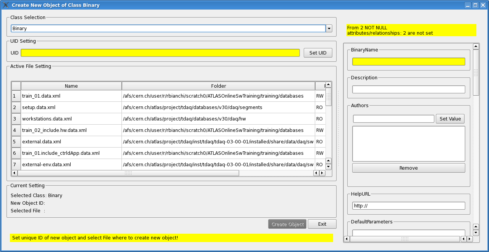
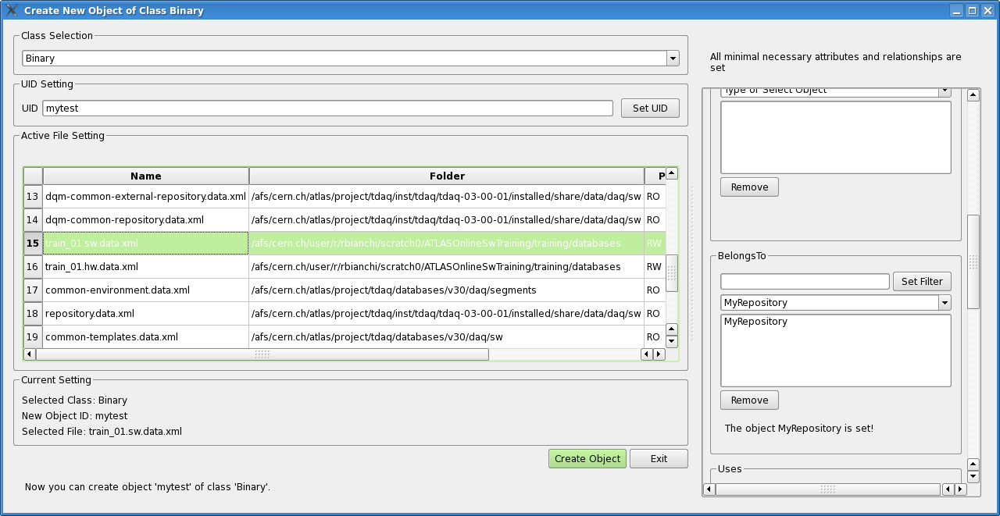

Create a new object
===================

As we told above, we can create a new DB object double-clicking on a class node in the tree view, or by selecting "Create Object" command in the context menu when right clicking on a class name. As a consequence a new window pops up, aimed at helping the user to define all necessary information to create a new object. That window is shown in Figure :num:`figure #fig-createnewobj`.

.. _fig_createNewObj:

   "Create New Object" window

In that window all the properties related to the selected class are displayed, ready to be filled in through forms and dropdown menus. The user is also somehow guided to fill the required attributes and relationships: all compulsory fields are highlighted on a yellow background, the steps to be done are suggested in the status bar and the ``"Create"`` button is grayed out until all those compusory fields are properly filled. 

As first step the user should select the database file where the new object will be saved. Please notice that the first time you select a database file, that will be saved as the default file; and it will be automatically highlighted and selected for you the next time you will open a Create Object window to create a new object.
To change the default file, just select another file from the table; the newly selected file will be automatically set as the new default one.

When those fields are filled, and the right `.xml` destination file where the new object will be saved is chosen, the ``"Create"`` button turns to green, and the object can be saved, as shown in Figure :num:`figure #fig-createnewobj-green`. Pushing on the "Create" button will add the new object to the DB **locally**. No changes are actually committed to the DB until the user does not click on the ``"Commit"`` command in the ``"Edit"`` menu.  

.. _fig_createNewObj_green:

   "Create New Object" window when all mandatory fields are filled and the destination .xml file is chosen

