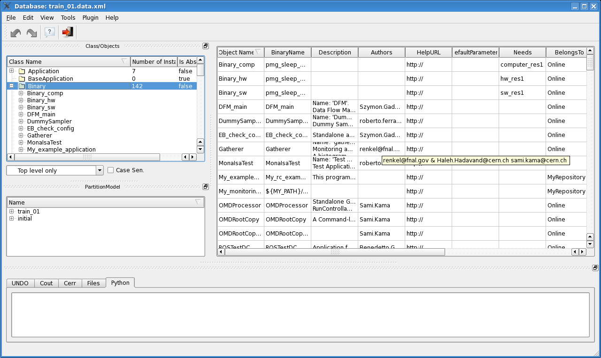
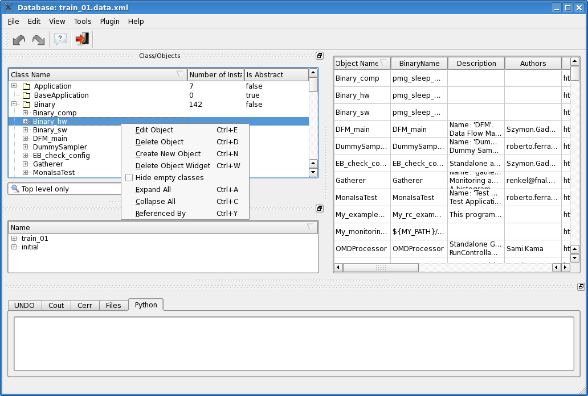
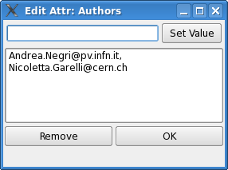
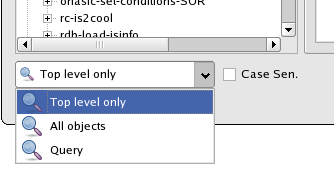

Navigation through DB objects
=============================

The tree view
-------------

The tree on the left side of the window contains all the OKS object types, and it's populated with the objects defined in the loaded DB file. The "lazy population" pattern is implemented, i.e. no sub-tree is built until requested by user action.  When the user click on an object type (let's say we click on "Binary", which is the class of all binary files used by applications), the tree element is expanded to show all the objects of that type, and a table is built on the right side of the window, as shown in Figure :num:`figure #fig-tablebuilt` below.

.. _fig_tableBuilt:

   When user clicks on a tree element, the corresponding table is built. It contains all objects of that class

By default the tree structure of DB classes and objects is build associating to a specific class (for instance "Binary") only objects whose type is exactly the selected class. In other words at start the tree is built with the "Build Direct Class Structure" command which we find in the "File" menu. In order to list all objects belonging to a class, i.e. also those objects whose class inherits from the given class, we have to explicitely use the command "Build Inherited Class Structure" form the same menu "File".

User actions:

   * Actions on **class items** (root items, displayed with a folder icon):
      * *Left-click on "+" icon beside class name*: the sub-tree is built and expanded in view
      * *Double-click on class*: the sub-tree is built and expanded in view
      * *Left-click on class*: the sub-tree is built and expanded in view. The table view for selected class is built and all objects are displayed in table.  
   * Actions on **object items** (child items, displayed with a file icon):
      * *Left-click on object*:  the sub-tree (relationships with corresponding objects) of the object is expanded in view and in table view are filtered out all objects but clicked
      * *Right-click*: opens context menu if located over classes and objects (see Figure :num:`figure #fig-tree-contextmenu`)
      * *Double click on object*: open "Object Editor" window 

In Figure :num:`figure #fig-tree-contextmenu` below, the context menu of a tree object is shown. If the right-click action is performed over a class (i.e. over a node of the tree), the first two options, "Edit Object" and "Delete Object", are not displayed. "Delete Object" command will delete the corresponding clicked object from DB. If we want to to select different objects to delete, the "Delete Object Widget" command may be used. "Hide Empty Classes" option will hide or display classes which contain no objects. "Expand All" and "Collapse All" will be applied on all classes with substructure. "Referenced By" will open new window with a tree structure of classes which reference the selected object.

.. _fig_tree_contextMenu:

   The Tree context menu

When we left-click on an object in the tree view, its substructure is expanded, i.e. the relationships are shown in the tree as sub-branches of the selected object. Values set to those relationships are then displayed as leaves, when we left-click on the relationship names. See Figure :num:`figure #fig-tree-relationships`. Please notice that the attributes, like "Authors" or "Binary Name" shown in the figures, are not rendered as branches in the tree on the left: only relationships are rendered as sub-branches of an object.

.. _fig_tree_relationships:

.. figure:: images/tree_relationships.png
   :width: 800px
   :alt: tree object relationships
   :figwidth: 800px
   :align: center

   The relationships sub-structure of a tree object

The table view
--------------

As already told, the table (see Figure :num:`figure #fig-tablebuilt`)  is built after selection (click) of a class in the tree. Each row in the table view represents an object associated with selected class. The columns hold information about attributes and relationships, whose name is reported in the column headers.

User action:

   * Double click on cell: start edit of cell
   * Right Click in table View: open context menu with two options:
      * Find Object: use to focus in Table View to row with searched object
      * Edit Cell: start edit selected cell

In case of multi-value attributes or relationships the position of items can be change by moving the items with the mouse. A drag and drop feature is being developed, in order to be able to move items from one atttribute/relationship to another, e.g. from "Segments" to "Disabled". 

On Figure :num:`figure #fig-editauthors` the example of an editor for a relationship is displayed. All changes in attribute or relationship values are put into the "undo/redo" stack, and so the user can always go back to the old values before any changes, through the buttons "Undo" and "Redo" on the toolbar below the menu bar.

.. _fig_editAuthors:

   Editing a multi-value attribute ("Authors" here in the example)

Search for an object
--------------------

To search a specific object inside the tree, we can use the "Find" tool. The "Find" widget contains a text field and a checkbox, as shown in Figure :num:`figure #fig-tree-findtool`. The results of the match are used to filter the items in the tree. The filtering operation used by default (option "*Top level*" only in the dropdown choice list) matches the string with class names. We can also choose the other option, "*All objects*", to perform string matching on all database objects. But the latter option can result in a time consuming operation where used over large DB like the ATLAS P1, because all DB structures have to be built and compared with the user filter string. The third implemented filtering option "*Query*" submits a user filter string to DB query to match a UIDs and displays in the Tree View only structures which contain the objects returned by query. The check box can be used for turning on and off case sensitivity on typed string. 

.. _fig_tree_findTool:

   The "Find" tool of the Tree view
