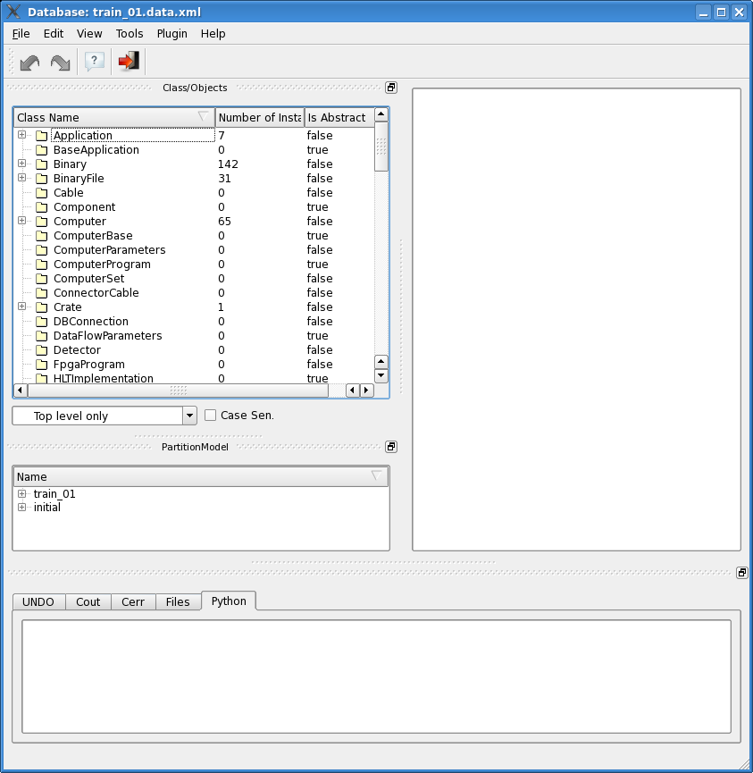
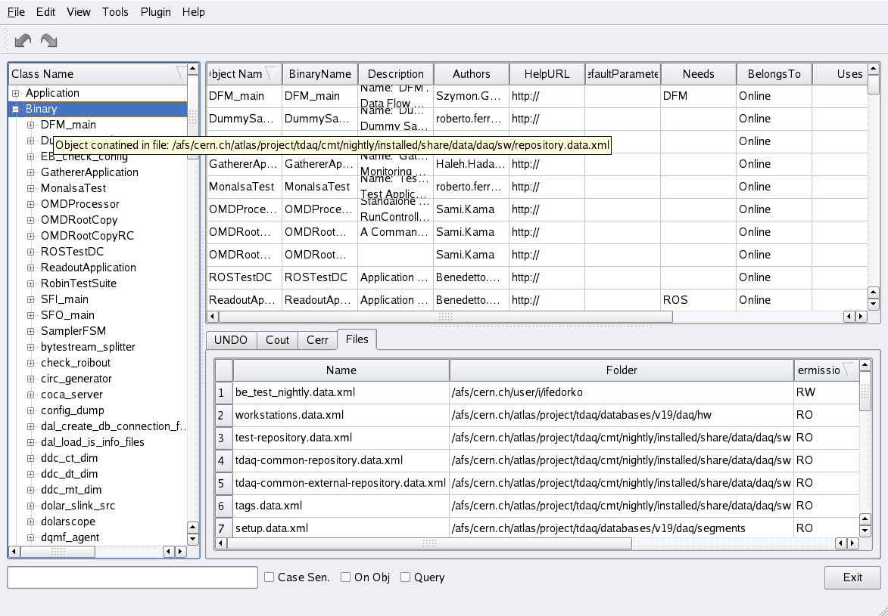

Loading a database
==================

The main window presented to the user at start is shown in :num:`figure #fig-mainwindow`. 

.. _fig-mainwindow:

   Main "dbe" window at start

From the *File* menu you can choose to open an OKS ``.xml`` file directly (``Open DB``) in edit mode (via "oksconfig"). In the window which pops up you can find direct links to ``$TDAQ_DIR`` and ``$TDAQ_INST_PATH``, for fast navigation to DB files. Or you can connect to a RDB from a specific partition clicking on the ``Connect to RDB`` command. From the same menu you can also chosse to create a new DB.  The DB will be accessed via rdbconfig implementation and no change of value will be allowed. To access archive of configuration data stored in Oracle database, select Open oracle DB.  The commands ``Buid Direct Class Structure`` and ``Build Inherited Class Structure`` load and build the corresponding tree. 

In the *Edit* menu you find the command to commit changes into the DB (``Commit``).

In the *View* menu you can choose which panels to load into the GUI:

   * Table view
   * Class view
   * Partition view
   * Segments and Resources view

In the example figure :num:`figure #fig-mainwindow` the "Segments and Resource" view is not loaded. 

In  the bottom part of the window a "Services" panel is shown. It contains 5 tabs:

  * **UNDO**: contains the stack of all commands and changed performed on DB objects before committing. When committed, the stack is cleared.
  * **Cout**: displays the std::out stream messages from the application, if any
  * **Cerr**: displays the std::err and Qt debug messages from the application, if any
  * **Files**: shows the list of loaded files
  * **Python**: part of the Python plug-in interface

The user can arrange all the panels as wanted, moving them within the application window. The new layout is then saved at exit, and reloaded when the program is started again.

Tool tip messages are set for many objects. In Figure :num:`figure #fig-tree-tooltip`  you can see that after pointing mouse over an object inside the tree, the pop up tool tip message displays the path of the file which contains the object. In the same Figure we can see how the "Files" tab of the "Services" panel shows a table containing all all database files which have been opened and loaded (directly by the user, or indirectly if included by other DB files). 

.. _fig_tree_tooltip:

   A Tree tool tip and the content of the "Files" tab

**Note:** Shortcuts are available for most commands and are usually listed in the menu. 

