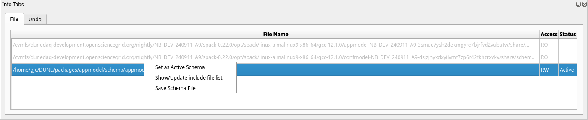
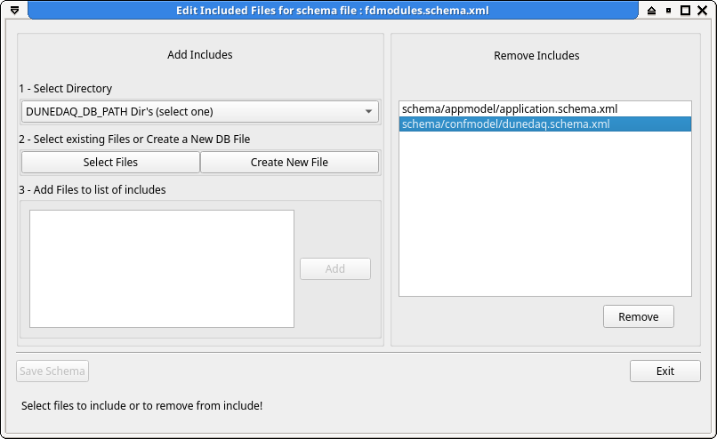
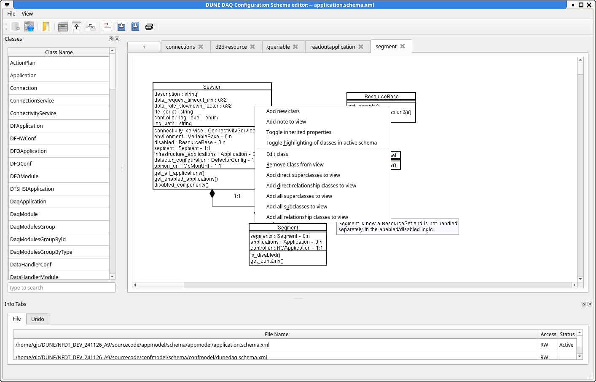
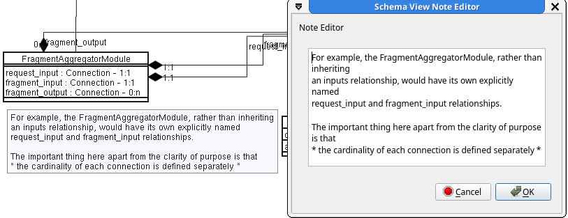

# The OKS schema editor: `schemaeditor`

## Prerequisite

 Before running either schemaeditor or dbe you must load the dbe spack
package with `spack load dbe`. This can have unwanted side effects
like running the wrong version of Python due to spack messing with
your PATH and LD_LIBRARY_PATH. To avoid this, keep your editing
sessions in a different window to your normal development or create an
alias /shell fucntion like:

```
function schemaeditor () 
{ 
    bash -c "spack load dbe; command schemaeditor $@"
}

```


## Starting the editor

 Just running the command `schemaeditor` will bring up the
schemaeditor with no schema files loaded. You can then either open an
existing schema file `File -> Open Schema` (or Ctrl+O) or create a
new empty schema file with `File->Create new schema` (or Ctrl+N).

To start with an existing schema file, use the `-f` option.

## Setting the 'Active' schema file

 All new classes are created in the active schema file. This will
initially be the file you loaded or created above unless the loaded
file is read-only or locked by another process. To make another file
the active schema file, use the context menu in the files tab
(right-click).

_NB:_ You cannot add new classes unless you have made a schema file
'Active'.



## Adding include files

 Most schema files will want to include at least the core dunedaq
schema (dunedaq.schema.xml) from confmodel. To add an include to the
currently active schema file, either `File->Add/Remove include files`
(<Ctl>I) or right click on the name of the schema file in the File
panel. This will bring up a dialog box for adding and removing include
files. From here you can add existing files or create a new schema
file.



<!--
 You can also see a list of files which are currently included by the
current schema file and remove any that are not needed.
 -->

## Saving files

 To save all modified schema files, `File->Save Schema` (Ctrl+S). To
save only a single file, use the context menu in the File tab. Tis
also allows you to save files that have not been updated (sometimes
useful to ensure proper formatting of files edited outside of the
schemaeditor.


## Adding new classes

 To add a new class Ctrl+A anywhere will bring up the new class
dialogue box. From here you can define the attributes and
relationships of your new class and set its superclass inheritance
from the list of existing classes.

New classes can also be added from the context menu in the schema view
tabs. This will place the new class on the schema diagram at the
current cursor position.

## Schema diagrams

 To create a class diagram of the defined classes, simply drag the
classes you are interested in from the 'Class Name' list onto a schema 
view tab. Relationships and inheritance connections will be
automatically drawn. By default, only the direct properties of the
classes are shown, to display all properties including those inherited
the context menu in the schema view panel icludes an option to toggle
inherited properties. The context menu on an individual class within
the view allows the addition of all its parent/child/related classes to
the view.



Multiple views of the schema can be created by selecting the "+"
button next to the view tabs. A tab can be renamed by selecting the
'Name View' button on the toolbar. Tbas can be closed by selecting the
cross ont the top corner of the tab or with the shortcut Ctl-W.

### Highlighting classes from the active schema file

The classes contained in the current schema fie can be highlighted by
selecting this option from the conrext menu. This can be useful to see
at a glance which classes are in which file. Changing the active file
from the File info tab will change which classes are highlighted
accordingly.

### Tool-tips

Hovering the mouse over a class in the schema view will bring up a
tool-tip with the description fields of the class and all its direct
attributes, relationships and methods.

### View files

The current schema diagram can be saved from the 'Save View' or 'Save
View as' buttons on the toolbar or printed via the 'Print View'
button. These options also exist in the View menu along with an option
to export to an SVG file.

Views can be loaded from files by using the Ctl-V shortcut or
selecting 'Load View' from the View menu. Views load into new tabs
unless the current tab is empty.

### Notes

Notes can be added to the view by selecting 'Add note to view' from
the context menu. Notes are currently written in very simple boxes
with plain text. Line breaks should be added by hand.




## Keyboard shortcuts

| Key   | Action | Notes |
|-------|:-------|-------|
| Ctl-A | Add new schema class | Only available when there is an 'Active' schema file|
| Ctl-N | Create New schema file | Only available when no schema files loaded|
| Ctl-O | Open new schema file  | Only available when no schema files loaded|
| Ctl-I | Open include dialog  | Only available when there is an 'Active' schema file|
| Ctl-S | Save modifed schema files  ||
| Ctl-V | Load View ||
| Ctl-W | Close tab ||
| Ctl-Q |  Quit  ||
